# acho

<p align="center">
  <br>
  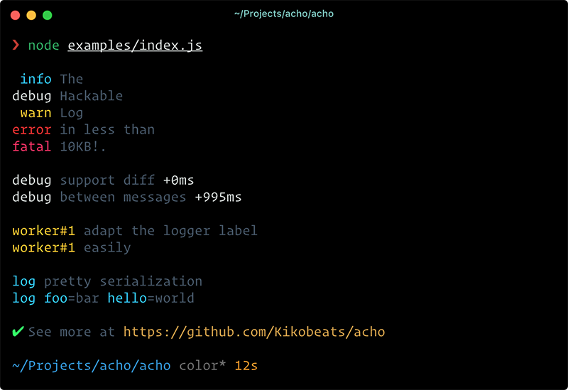
  <br>
</p>


[](https://travis-ci.org/achohq/acho)
[](https://coveralls.io/github/achohq/acho)
[](https://david-dm.org/achohq/acho)
[](https://david-dm.org/achohq/acho#info=devDependencies)
[](https://www.npmjs.org/package/acho)
[](https://paypal.me/kikobeats)

> The Hackable Log

# Features

* Different log levels skins.
* Beauty object interpolation.
* Diff & log trace support.
* Easy to customize, easy to hack.

## Install

```bash
npm install acho
```

## Usage

### Logging levels

<p><details>
  <summary>
    <b>Examples</b>
    </summary>
  <ul><li><a href="./examples/levels.js">Defaults</a></li><li><a href="./examples/skin-cli.js">Skin CLI</a></li><li><a href="./examples/skin-syslog.js">Skin Syslog</a></li></ul>
</details></p>

<p align="center">
  <br>
  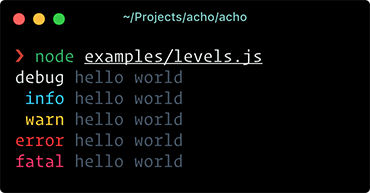
  <br>
</p>

The first thing you need to do is create a new log instance:

```js
const acho = require('acho')
const log = acho()
```

Then you can print a log based on the level:

```js
const acho = require('acho')
const log = acho()

acho.info('hello world')
```

All methods are chainables:

```js
const acho = require('acho')
const log = acho()

acho
.info('hello world')
.error('something bad happens')
```

Establishing the loglevel is a good way to filter out undesired information from output. The available levels by default are:

- `fatal` : Display calls to `.fatal()` messages.
- `error` : Display calls to `.fatal()`, `.error()` messages.
- `warn`  : Display calls from `.fatal()`, `.error()`, `.warn()` messages.
- `info`  : Display calls from `.fatal()`, `.error()`, `.warn()`, `info()` messages.
- `debug` : Display calls from `.fatal()`, `.error()`, `.warn()`, `info()`, `debug()` messages.

Additionally exists two special levels:

- `muted` :  Avoid all output.
- `all`   : Allow print all message types.

The default log level is `all`. You can define it in the constructor:

```js
const acho = require('acho')
const log = acho({level: 'debug'})
```

or at runtime:

```js
log.level = 'debug'
```

### Internal Store

Sometimes, when you are interacting with a logger you need to store the logs to be used later instead of print all of them.

We define `.push` as accumulator for store the log internally:

<p align="center">
  <br>
  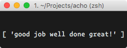
  <br>
</p>

```js
const acho = require('acho')
const log = acho()

log.push('success', 'good job', 'well done', 'great!')
console.log(log.messages.success)
```

If you want to print previously stored messages, just call the method `.print`:

<p align="center">
  <br>
  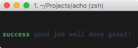
  <br>
</p>

or you can retrieve the logs programatically from the internal storage  at `acho.messages`

The method  `.add` combine `.push` and `.print` actions in one: It store the message internally but also print the log.

<p align="center">
  <br>
  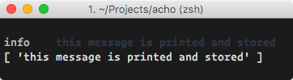
  <br>
</p>

```js
log.add('info', 'this message is printed and stored')
console.log(acho.messages.info)
```

## Formatters

<p><details>
  <summary>
    <b>Examples</b>
    </summary>
  <ul><li><a href="./examples/interpolation.js">Interpolation</a></li></ul>
</details></p>

<p align="center">
  <br>
  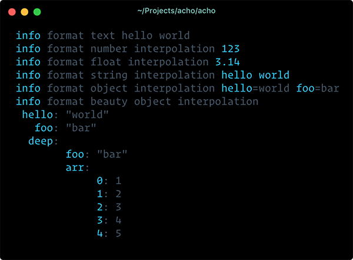
  <br>
</p>


We use [printf-style](https://wikipedia.org/wiki/Printf_format_string) formatting. Below are the officially supported formatters:

| Formatter | Representation                                                |
|-----------|---------------------------------------------------------------|
| `%s`      | String.                                                       |
| `%d`      | Number (both integer and float).                              |
| `%j`      | JSON serialization in one line                                |
| `%J`      | JSON pretty object in multiple lines                          |
| `%%`      | Single percent sign ('%'). This does not consume an argument. |

By default, the `%j` is applied when you pass an object to be logged:

```js
const acho = require('acho')
const log = acho()

log.info({hello: 'world', foo: 'bar'})
// => 'info hello=world foo=bar'
```

If you want to use a different formatter, use printf markup:

```js
const acho = require('acho')
const log = acho()

log.info('formatting with object interpolation %J', {
  hello: 'world',
  foo: 'bar',
  deep: {
    foo: 'bar',
    arr: [1, 2, 3, 4, 5]
  }
})
```

### Customization

<p><details>
  <summary>
    <b>Examples</b>
    </summary>
  <ul><li><a href="./examples/trace.js">Trace & Diff</a></li><li><a href="./examples/uppercase.js">Uppercase</a></li></ul>
</details></p>

One of the **acho** compromise is be easy to adapt. You can completely customize all the library functionalities.

For example, suppose you want to add a timestamp before your logs:

<p align="center">
  <br>
  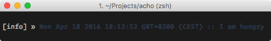
  <br>
</p>

```js
const acho = require('acho')

const log = acho({
  // Customize how to print the 'type' of each message
  outputType: type => `[${type}]`,

  // Customize how to print the message.
  // Add things before and/or after.
  outputMessage: message => `${Date.now()} :: ${message}`
})

acho.info('I am hungry')
```

That's all.

## API

### Acho([options])

It creates a logger instance. Available options:

##### **{String}** keyword

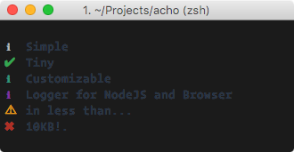

Default: `loglevel`

Instead of print the type log level, print the keyword. By default this behavior is not activated.

You can pass the special keyword `symbol` to show an unicode icon. This is special behavior for CLI programs.

##### **{String}** align

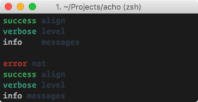

Default: `' '`

It adds an alignment separator between the type of the message and the message.

You can provide your own separator or disable it providing a `false`.

##### **{Boolean}** diff

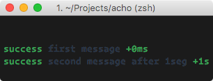

Default: `false`

Prints trace between log from the same level. Specially useful to debug timings.

##### **{Boolean}** upperCase


Default: `false`.

Enable or disable print log level in upper case.

##### **{Boolean|Number}** trace

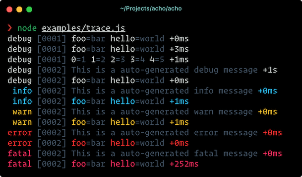

Default: `false`.

Prints a numeric counter trace associated with each log line. 

The value provided is the minimum quantity of time in milliseconds to consider print a different counter.

##### **{Number}** offset

Default: `2`.

The amount of left whitespace between the property key and all of it's sub-properties.

This option is only applied under JSON pretty object in multiple lines (%J).

##### **{Number}** depth

Default: `Infinity`.

Colapses all properties deeper than specified by depth.

This option is only applied under JSON pretty object in multiple lines (%J).

##### **{String}** level

Default: `all`

Provides the logging level. This sets from what level print logs using tranport.

Additionally you can provide `muted` to express don't print logs.

##### **{Function}** transport

Default: `console.log`

Defines where write the log message.

##### **{Object}** types

You can provide the types and priorities.

##### **{Object}** messages

It provides a initial internal store state per each log level. This option is useful when you want to integrate the logger with the ouptut of a delayed function.

##### **{Function}** print

Provides a function that determines how to print the messages. By default uses `.generateMessage` for generate the mesage that will be outputted.

##### **{Function}** outputType

Provides a function to customize the type in the output.

##### **{Function}** outputMessage

Provides a function to customize the message in the output.

##### **{Function}** generateMessage

Provides a function that generate the message to be outputted. It combines other internal methods for generate the output (as `.isPrintable` or `.colorize`) and normally you are not interested in the definition of it, but you can provide it as option as well.

##### **{Function}** generateTypeMessage

Provides a function used to generate the type message.

### .push({String} &lt;type&gt;, {String} &lt;message&gt;)

Store a message of given `type` internally.

### .add({String} &lt;type&gt;, {String} &lt;message&gt;)

Store a message of given `type` internally and also output it.

For each level you have a function following the pattern:

### .print()

Prints all messages internally stored.

### .\[loglevel\]({String} &lt;message&gt;)

For each log level that you declared in the constructor (or the default log levels provides by the library if you don't declare nothing) will be created a function with the same name to output a message with these log level.

## License

MIT © [Kiko Beats](http://www.kikobeats.com)
