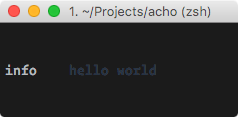
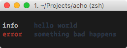

# acho

<p align="center">
  <br>
  
  <br>
</p>


[](https://travis-ci.org/achohq/acho)
[](https://coveralls.io/github/achohq/acho)
[](https://david-dm.org/achohq/acho)
[](https://david-dm.org/achohq/acho#info=devDependencies)
[](https://www.npmjs.org/package/acho)
[](https://paypal.me/kikobeats)

> Simple & hackable log system for NodeJS.

# Why

* Easy to use, customize and extend.
* Expressive API with chaineable methods.
* Mininum dependencies, just focussing on one thing.
* Compatible with AMD/CommonJS or just global object in the browser.

## Install

```bash
npm install acho
```

If you want to use it in the browser (powered by [Browserify](http://browserify.org/)):

```bash
bower install acho --save
```

and later add it to your HTML:

```html
<script src="bower_components/acho/dist/acho.js"></script>
```

## Usage

### First steps

Acho exports itself according to UMD best practices, which means that no matter where you are using the library, you get a version tailored for your environment.

If you're using a module loader (or Node), simple require the library as you would any other module.

If you're using a browser, the library falls back to attaching itself to window as the global `Acho`.

#### CommonJS

```js
var Acho = require('acho');
var acho = Acho();
```

#### Global/Browser

```js
var acho = Acho();
```

#### AMD

I don't personally use AMD, so I can't conjure an example, but it should work fine as well.

It's time to use it!

<p align="center">
  <br>
  
  <br>
</p>

```js
acho.info('hello world');
```

All public methods are chainable:

<p align="center">
  <br>
  
  <br>
</p>

```js
acho
.info('hello world')
.error('something bad happens');
```

Maybe you don't want to output the message, but store it for later use:

<p align="center">
  <br>
  
  <br>
</p>

```js
acho.push('success', 'good job', 'well done', 'great!');
console.log(acho.messages.success);
```

If you want to print previously stored messages, just call the method `print`:

<p align="center">
  <br>
  
  <br>
</p>

```js
acho.print()
```

You might be thinking: Can I combine both, to store and both print a message? Absolutely!

<p align="center">
  <br>
  
  <br>
</p>

```js
acho.add('info', 'this message is printed and stored');
console.log(acho.messages.info)
```

### Defining the level

Establishing the loglevel is a good way to filter out undesired information from output. The available levels by default are:

- `fatal` : Display calls to `.fatal()` messages.
- `error` : Display calls to `.fatal()`, `.error()` messages.
- `warn`  : Display calls from `.fatal()`, `.error()`, `.warn()` messages.
- `info`  : Display calls from `.fatal()`, `.error()`, `.warn()`, `info()` messages.
- `debug` : Display calls from `.fatal()`, `.error()`, `.warn()`, `info()`, `debug()` messages.

Additionally exists two special levels:

- `muted` :  Avoid all output.
- `all`   : Allow print all message types.

The default log level is `all`. You can define it in the constructor:

```js
var acho = Acho({level: 'debug'})
```

or at runtime:

```js
acho.level = 'debug';
```

See more at [examples/levels](https://github.com/achohq/acho/blob/master/examples/levels.js).

### Customization

You can completely customize the library to your requirements: changes colors, add more types, sort the priorities... the internal structure of the object is public and you can edit it dynamically. **You have the power**.

By default the messages structure is brief: Just the message type followed by the message itself.

But you can easily modify the output. For example, let's add a timestamp to each message:

<p align="center">
  <br>
  
  <br>
</p>

```js
var acho = Acho({
  color: true,
  level: 'debug',

  // Customize how to print the 'type' of each message
  outputType: function(type) {
    return '[' + type + '] » ';
  },

  // Customize how to print the message.
  // Add things before and/or after.
  outputMessage: function(message) {
    return Date() + ' :: ' + message;
  }
});

acho.info('I am hungry');
```

If you need customize more the output you can setup `.print` `.generateMessage` (see below) that are a more low level methods for generate and print the output message.

## Formatters

We use [printf-style](https://wikipedia.org/wiki/Printf_format_string) formatting. Below are the officially supported formatters:

| Formatter | Representation                                                |
|-----------|---------------------------------------------------------------|
| `%s`      | String.                                                       |
| `%d`      | Number (both integer and float).                              |
| `%j`      | JSON serialization in one line                                |
| `%J`      | JSON pretty object in multiple lines                          |
| `%%`      | Single percent sign ('%'). This does not consume an argument. |

By default, the `%j` is applied when you pass an object to be logged:

```js
acho.info({hello: 'world', foo: 'bar'})
// => 'info hello=world foo=bar'
```

If you want to use a different formatter, use printf markup:

```js
acho.info('formatting with object interpolation %J', {
  hello: 'world',
  foo: 'bar',
  deep: {
    foo: 'bar',
    arr: [1, 2, 3, 4, 5]
  }
})

// info formatting with object interpolation
//  hello: "world"
//    foo: "bar"
//   deep:
//         foo: "bar"
//         arr:
//              0: 1
//              1: 2
//              2: 3
//              3: 4
//              4: 5
```

See more at [examples/formatter](https://github.com/achohq/acho/blob/master/examples/formatter.js).

## API

### Acho({Object} [options])

Create a logger. Available options:


##### **{String}** keyword

Default: `loglevel`

Instead of print the type log level, print the keyword. By default this behavior is not activated.

You can pass the special keyword `symbol` to show an unicode icon. This is special behavior for CLI programs.


##### **{String}** align

Default: `' '`

It adds an alignment separator between the type of the message and the message.

You can provide your own separator or disable it providing a `false`.


##### **{Boolean}** diff

Default: `false`

Prints timestamp between log from the same level. Specially useful to debug timmings.

##### **{Boolean}** color

Default: `false`.

Enable or disable colorized output.

##### **{Boolean}** upperCase

Default: `false`.

Enable or disable print log level in upper case.

##### **{Number}** timestamp

Default: `0`.

Prints a counter timestamp associated with each log line. Useful for debug log traces.

##### **{Number}** offset

Default: `2`.

The amount of left whitespace between the property key and all of it's sub-properties.

This option is only applied under JSON pretty object in multiple lines (%J).

##### **{Number}** depth

Default: `Infinity`.

Colapses all properties deeper than specified by depth.

This option is only applied under JSON pretty object in multiple lines (%J).

##### **{String}** level

Default: `all`

Provides the logging level. This sets from what level print logs using tranport.

Additionally you can provide `muted` to express don't print logs.

##### **{Function}** transport

Default: `console.log`

Defines where write the log message.

##### **{Object}** types

You can provide the types and priorities.

##### **{Object}** messages

It provides a initial internal store state per each log level. This option is useful when you want to integrate the logger with the ouptut of a delayed function.

##### **{Function}** print

Provides a function that determines how to print the messages. By default uses `.generateMessage` for generate the mesage that will be outputted.

##### **{Function}** outputType

Provides a function to customize the type in the output.

##### **{Function}** outputMessage

Provides a function to customize the message in the output.

##### **{Function}** generateMessage

Provides a function that generate the message to be outputted. It combines other internal methods for generate the output (as `.isPrintable` or `.colorize`) and normally you are not interested in the definition of it, but you can provide it as option as well.

##### **{Function}** generateTypeMessage

Provides a function used to generate the type message.

### .push({String} &lt;type&gt;, {String} &lt;message&gt;)

Store a message of given `type` internally.

### .add({String} &lt;type&gt;, {String} &lt;message&gt;)

Store a message of given `type` internally and also output it.

For each level you have a function following the pattern:

### .print()

Prints all messages internally stored.

### .\[loglevel\]({String} &lt;message&gt;)

For each log level that you declared in the constructor (or the default log levels provides by the library if you don't declare nothing) will be created a function with the same name to output a message with these log level.

## License

MIT © [Kiko Beats](http://www.kikobeats.com)
